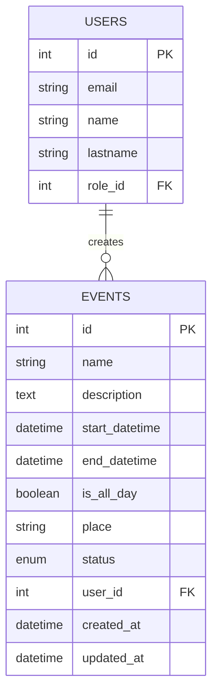
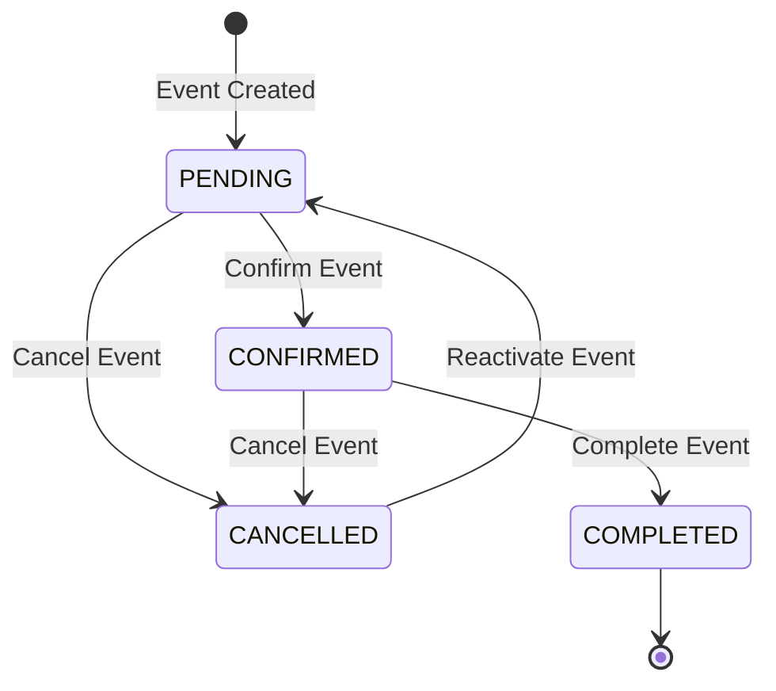

# Event Management Implementation Plan

## Overview

This document outlines the implementation plan for the event management system. Events are created by users with "client" role who have `read:events` and `write:events` permissions. All authenticated users should have access to view all events to check availability.

## Updated Database Design

### New Events Table Structure

```sql
CREATE TABLE public.events (
    id integer,
    name text NOT NULL,
    description text,
    start_datetime timestamp NOT NULL,
    end_datetime timestamp NOT NULL,
    is_all_day boolean DEFAULT false NOT NULL,
    place text NOT NULL,
    status eventstatus DEFAULT 'PENDING' NOT NULL,
    user_id bigint NOT NULL REFERENCES public.users(id),
    created_at timestamp with time zone DEFAULT now() NOT NULL,
    updated_at timestamp with time zone DEFAULT now() NOT NULL
);
```

### Field Changes from Current Structure

| Current Field | New Field | Notes |
|--------------|-----------|-------|
| `date` (Date) | `start_datetime` (DateTime) | Combined date + time into datetime |
| `time` (Time) | `end_datetime` (DateTime) | End time for the event |
| - | `is_all_day` (Boolean) | New field - defaults to false |
| `created_by` (String) | `user_id` (BigInt FK) | Foreign key to users table |
| `reference_phone` | - | Removed field |

### Event Status Enum

```python
class EventStatus(str, enum.Enum):
    PENDING = "PENDING"
    CONFIRMED = "CONFIRMED"
    CANCELLED = "CANCELLED"
    COMPLETED = "COMPLETED"
```

## Architecture

### Entity Relationship Diagram



### Status Flow



## Implementation Steps

### Step 1: Database Migration
- [ ] Create Alembic migration to update events table:
  - Add `start_datetime` column (DateTime)
  - Add `end_datetime` column (DateTime)
  - Add `is_all_day` column (Boolean)
  - Add `user_id` column (BigInt FK)
  - Remove `date` column
  - Remove `time` column
  - Remove `created_by` column
  - Remove `reference_phone` column

### Step 2: Model Layer
- [ ] Update [`models/event.py`](models/event.py):
  - Add `start_datetime` field
  - Add `end_datetime` field
  - Add `is_all_day` field
  - Add `user_id` relationship
  - Remove deprecated fields

### Step 3: Schema Layer
- [ ] Update [`schemas/event.py`](schemas/event.py):
  - Add `start_datetime` to EventBase
  - Add `end_datetime` to EventBase
  - Add `is_all_day` to EventBase
  - Add `user_id` to EventResponse
  - Remove deprecated fields

### Step 4: Data Layer
- [ ] Create [`data/event.py`](data/event.py):
  - CRUD operations for events
  - Include user relationship in queries

### Step 5: Service Layer
- [ ] Create [`services/event.py`](services/event.py):
  - Business logic for event operations
  - Event availability checking logic

### Step 6: Web Layer (API Endpoints)
- [ ] Create [`web/event.py`](web/event.py):

| Method | Endpoint | Description | Permissions |
|--------|----------|-------------|-------------|
| GET | /api/events | List all events | Authenticated |
| GET | /api/events/{event_id} | Get event by ID | Authenticated |
| POST | /api/events | Create new event | client role + write:events |
| PATCH | /api/events/{event_id} | Update event | client role + write:events (owner only) |
| DELETE | /api/events/{event_id} | Delete event | client role + delete:events (owner only) |
| PATCH | /api/events/{event_id}/status | Change status | admin role |

### Step 7: Event Status History (Optional Enhancement)
- [ ] Create [`models/event_status_history.py`](models/event_status_history.py)
- [ ] Create [`schemas/event_status_history.py`](schemas/event_status_history.py)
- [ ] Create [`data/event_status_history.py`](data/event_status_history.py)
- [ ] Create [`services/event_status_history.py`](services/event_status_history.py)

## Permissions Matrix

| Action | Required Role | Required Permission |
|--------|---------------|---------------------|
| View all events | Any authenticated | - |
| Create event | client | write:events |
| Update own event | client | write:events |
| Delete own event | client | delete:events |
| Change event status | admin | manage:events |
| View event history | admin | read:events |

## API Request/Response Examples

### Create Event (POST /api/events)

**Request:**
```json
{
    "name": "Birthday Party",
    "description": "Annual birthday celebration",
    "start_datetime": "2026-04-15T14:00:00Z",
    "end_datetime": "2026-04-15T18:00:00Z",
    "is_all_day": false,
    "place": "Central Park"
}
```

**Response:**
```json
{
    "id": 1,
    "name": "Birthday Party",
    "description": "Annual birthday celebration",
    "start_datetime": "2026-04-15T14:00:00Z",
    "end_datetime": "2026-04-15T18:00:00Z",
    "is_all_day": false,
    "place": "Central Park",
    "status": "PENDING",
    "user_id": 5,
    "created_at": "2026-03-20T11:00:00Z",
    "updated_at": "2026-03-20T11:00:00Z"
}
```

### List Events (GET /api/events)

**Query Parameters:**
- `skip` (int): Pagination offset
- `limit` (int): Page size
- `start_date` (datetime): Filter by start date
- `end_date` (datetime): Filter by end date

### Check Availability

All authenticated users can access all events to check availability. This is achieved by:
1. GET /api/events - Returns all events
2. Users filter based on their needs (date range, place, etc.)

## Files to Create/Modify

### New Files
- `data/event.py`
- `services/event.py`
- `web/event.py`
- `tests/unit/data/test_event.py`
- `tests/unit/services/test_event.py`
- `tests/unit/web/test_event.py`
- `alembic/versions/xxx_update_events_table_new_schema.py`

### Modified Files
- `models/event.py` - Update fields
- `schemas/event.py` - Update schemas
- `main.py` - Register event router

## Testing Strategy

1. **Model Tests**
   - Event model validation
   - Datetime handling
   - Boolean is_all_day

2. **Schema Tests**
   - EventCreate validation
   - EventResponse serialization

3. **Data Layer Tests**
   - CRUD operations
   - User relationship

4. **Service Layer Tests**
   - Event creation
   - Availability checking

5. **Web Layer Tests**
   - All endpoints
   - Permission checks
   - Role-based access

## Issues Found During Testing

### Issue 1: Event Creation in the Past
- **Description**: Users can currently create events with start_datetime in the past, which should not be allowed.
- **Current Status**: Validation not implemented in `services/event.py` create function.
- **Impact**: Allows invalid events to be scheduled.
- **Fix Plan**:
  1. Add validation in `services/event.py` create function to check if `event_create.start_datetime < datetime.now()`.
  2. Raise `ConflictError` with message "Cannot create events in the past".
  3. Add unit test in `tests/unit/services/test_event.py` for this validation.
  4. Update API documentation to reflect this constraint.

## Implementation Order

1. **Migration** - Update database schema
2. **Model** - Update Event model
3. **Schema** - Update schemas
4. **Data** - Create data layer
5. **Service** - Create service layer
6. **Web** - Create API endpoints
7. **Tests** - Add unit tests

## IMPROVEMENTS

### Role-Based Event Visibility for Musicians (Musician Event Filtering)

**Requirement**: For users with roles `musician` or `auxiliar_musician`, `GET /api/events/` and `GET /api/events/calendar` must return **only** the events to which the musician is assigned (via `event_musician` table). Admin/client roles continue to see all events.

**TDD Approach** (tests written before implementation in every layer):

#### Phase 0: Current State Analysis
- `web/event.py:47` (get_all) and `web/event.py:99` (get_calendar) call services without role awareness.
- `services/event.py:208` (get_paginated) and `get_by_month` delegate to data layer.
- `data/event.py:320` (get_paginated) and `get_events_by_month` perform unfiltered queries on `Event` only.
- JWT payload already contains `role` and `user_id` via `get_current_user`.

#### Phase 1: Data Layer (TDD)
1. Write failing tests in `tests/unit/data/test_event.py`:
   - `test_get_paginated_musician_returns_only_assigned_events`
   - `test_get_paginated_auxiliar_musician_filters_correctly`
   - `test_get_paginated_admin_returns_all_events`
   - `test_get_by_month_musician_filters_by_assignment`
2. Extend `data/event.py`:
   - Add optional params `current_user_role: str | None = None`, `current_user_id: int | None = None`.
   - When role ∈ {"musician", "auxiliar_musician"}: `JOIN event_musicians ON events.id = event_musicians.event_id WHERE event_musicians.musician_id = current_user_id`.
   - Preserve pagination, sorting, all existing filters.
3. Re-run tests until green.

#### Phase 2: Service Layer (TDD)
1. Add corresponding tests in `tests/unit/services/test_event.py`.
2. Update `services/event.py:get_paginated` and `get_by_month` to accept and forward role/user_id to data layer.

#### Phase 3: Web Layer (TDD)
1. Add tests in `tests/unit/web/test_event.py` using mocked tokens for each role.
2. Modify `web/event.py:get_all` and `get_calendar`:
   - Extract `role = current_user.get("role")` and `user_id = current_user.get("user_id")`.
   - Pass both to service calls.
3. Update endpoint docstrings to document the new behavior.

#### Phase 4: Integration, Docs & Validation
- Add one integration test covering full musician flow (token → assigned events only).
- Update `endpoints.rest` and API documentation.
- Run full test suite + lint (`pytest`, `ruff`).
- No new endpoint created; existing endpoints extended.

**Success Criteria**
- Zero breaking changes for admin/client flows.
- Musicians see exactly their assigned events (via `event_musician`).
- All layers covered by unit + integration tests (>90% coverage on modified paths).
- Documentation and REST examples updated.
