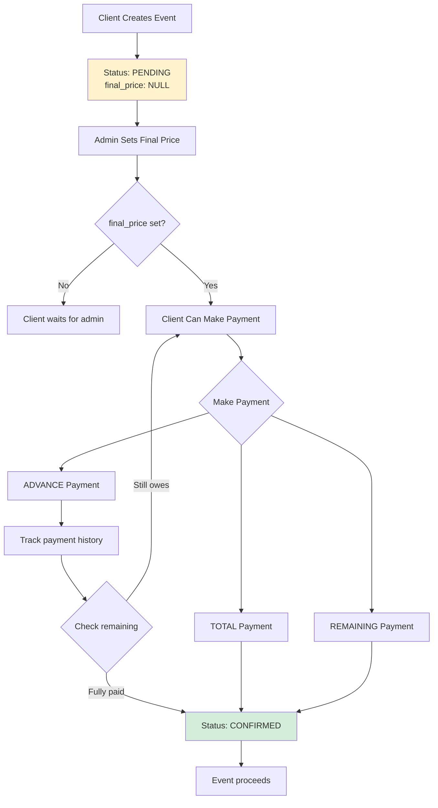

# Event Payment Feature Plan

## Overview

This document outlines the implementation plan for adding payment tracking to the musical band event management system.

## Current State

- Events have a status field (PENDING, CONFIRMED, CANCELLED, COMPLETED)
- Events are created by client users
- No payment tracking currently exists

## User Requirements Summary

1. **Client creates event** → Status = PENDING (no payment yet)
2. **Admin sets final price** → Defines the total cost of the event
3. **Client makes payments** → Can make one or more ADVANCE payments
4. **Remaining payment** → Client pays remaining balance (TOTAL - ADVANCE)
5. **Final payment** → When fully paid, event can be confirmed

## Proposed Table Design

Based on your proposed table, here's an enhanced version:

```sql
CREATE TABLE public.event_payments (
    id bigint PRIMARY KEY GENERATED ALWAYS AS IDENTITY,
    event_id bigint NOT NULL REFERENCES public.events(id),
    user_id bigint NOT NULL REFERENCES public.users(id),
    payment_date timestamp DEFAULT now() NOT NULL,
    amount numeric NOT NULL,
    payment_type text NOT NULL CHECK (payment_type IN ('ADVANCE', 'TOTAL', 'REMAINING')),
    notes text,
    created_at timestamp DEFAULT now() NOT NULL
);
```

### Recommended Changes from Your Proposal:
1. **Added CHECK constraint** on payment_type to ensure only valid values
2. **Added notes field** for payment notes (receipt references, etc.)
3. **Added created_at** for audit tracking

## Additional Database Changes

### 1. Add price field to events table
```sql
ALTER TABLE public.events ADD COLUMN final_price numeric;
```

This allows the admin to set the total event cost.

## Payment Workflow



## Payment Types Logic

| Payment Type | Description | When Used |
|-------------|-------------|-----------|
| ADVANCE | Partial payment towards total | Client makes initial/down payment |
| REMAINING | Pays the remaining balance | After advances, pays rest |
| TOTAL | Pays full amount at once | Client pays everything in one go |

## Implementation Tasks

### Phase 1: Database & Models
- [ ] Add `final_price` column to events table
- [ ] Create `EventPayment` model
- [ ] Create Alembic migration

### Phase 2: Data Layer
- [ ] Create `data/event_payment.py` with CRUD operations
- [ ] Add helper functions:
  - `get_payments_by_event(event_id)`
  - `get_total_paid(event_id)`
  - `get_pending_balance(event_id)`

### Phase 3: Schemas
- [ ] Create `schemas/event_payment.py`:
  - `EventPaymentBase`
  - `EventPaymentCreate`
  - `EventPaymentResponse`
  - `EventPaymentType` enum

### Phase 4: Service Layer
- [ ] Create `services/event_payment.py`:
  - `create_payment(event_id, user_id, amount, payment_type)`
  - `get_event_payment_summary(event_id)` - returns paid, pending, total

### Phase 5: API Endpoints
- [ ] Create `web/event_payment.py`:
  - `POST /api/events/{event_id}/payments` - Add payment
  - `GET /api/events/{event_id}/payments` - List payments
  - `GET /api/events/{event_id}/payments/summary` - Payment summary

### Phase 6: Event Integration
- [ ] Update `Event` model to include final_price field
- [ ] Add endpoint for admin to set final price: `PATCH /api/events/{event_id}/price`
- [ ] Add logic to auto-confirm event when fully paid (optional)

### Phase 7: Testing
- [ ] Unit tests for data layer
- [ ] Unit tests for service layer
- [ ] Unit tests for API endpoints

## Access Control

| Action | Client | Admin |
|--------|--------|-------|
| Create event | ✓ | ✓ |
| Set final price | - | ✓ |
| View own event payments | ✓ | ✓ |
| View all payments | - | ✓ |
| Add payment | ✓ (own events) | ✓ (all events) |

## Validation Rules

1. Payment amount must be positive
2. Total payments cannot exceed final_price (for ADVANCE + REMAINING)
3. Cannot add payments to events without final_price set
4. Payment_type VALIDATE:
   - ADVANCE: can be used multiple times
   - REMAINING: only when advances exist
   - TOTAL: only when no previous payments

## Questions for Clarification

1. Should the event status automatically change to CONFIRMED when fully paid?
2. Is there a minimum advance payment percentage required?
3. Should there be a payment deadline based on event date?
4. Do we need to support refunds?
5. Should we track who processed the payment (admin vs client-initiated)?
