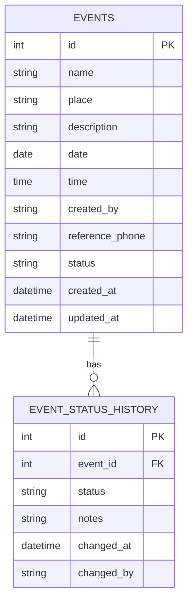
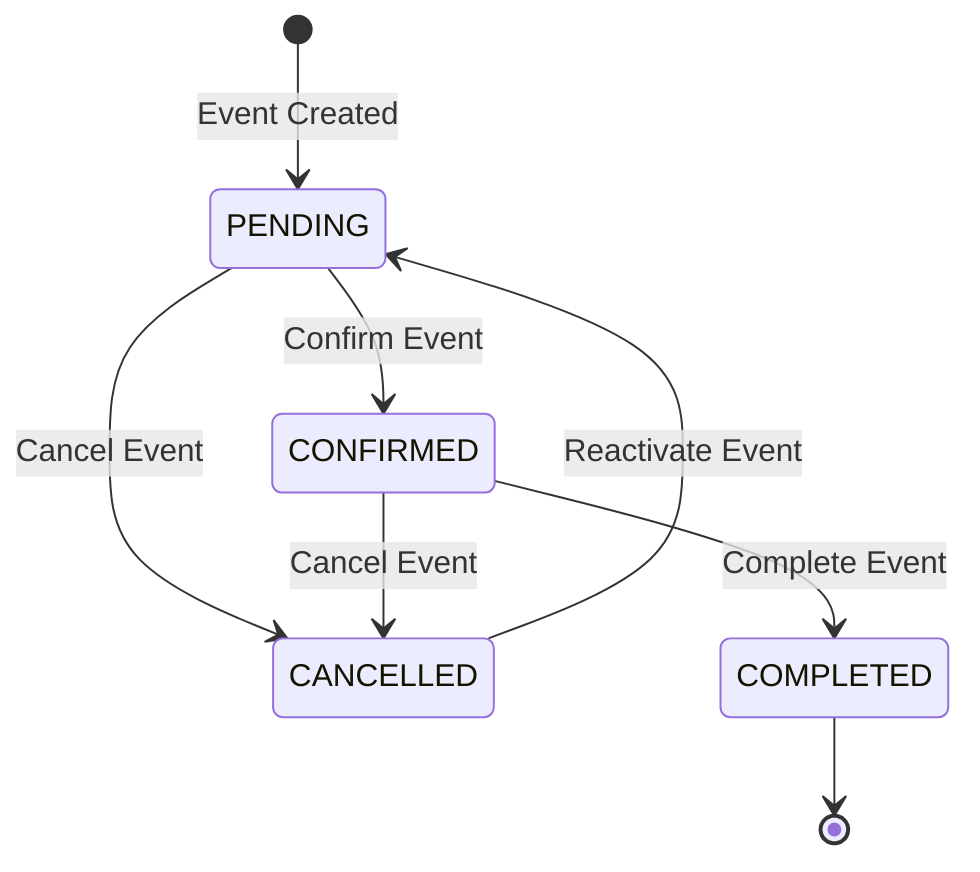

# Event Status Tracking Implementation Plan

## Overview

This document outlines the implementation plan for tracking event status changes with a complete audit trail. The design uses a separate `event_status_history` table to record all status transitions with timestamps, user information, and notes/reasons.

## Database Design

### Event Status Enum

```python
class EventStatus(str, enum):
    PENDING = "PENDING"
    CONFIRMED = "CONFIRMED"  
    CANCELLED = "CANCELLED"
    COMPLETED = "COMPLETED"
```

### Events Table Updates

Add a `status` field to the existing events table:

| Column | Type | Description |
|--------|------|-------------|
| status | String(20) | Current status - default: PENDING |

### Event Status History Table

New table to track all status changes:

| Column | Type | Description |
|--------|------|-------------|
| id | Integer | Primary key |
| event_id | Integer | Foreign key to events table |
| status | String(20) | The status that was set |
| notes | String(500) | Optional reason/notes for the change |
| changed_at | DateTime | When the status was changed |
| changed_by | String(100) | Name of user who made the change |

## Architecture Diagram



## Status Flow



## Implementation Layers

### 1. Models Layer

- Update [`models/event.py`](models/event.py) - Add status field with default PENDING
- Create [`models/event_status_history.py`](models/event_status_history.py) - New model for status history

### 2. Schemas Layer

- Update [`schemas/event.py`](schemas/event.py) - Add status to schemas
- Create [`schemas/event_status_history.py`](schemas/event_status_history.py) - Schema for status history

### 3. Data Layer

- Update [`data/event.py`](data/event.py) - Handle status field in modify
- Create [`data/event_status_history.py`](data/event_status_history.py) - CRUD for status history

### 4. Services Layer

- Update [`services/event.py`](services/event.py) - Add change_status method
- Create [`services/event_status_history.py`](services/event_status_history.py) - Business logic for status history

### 5. Web Layer

- Create [`web/event.py`](web/event.py) - REST endpoints for events
- Add status change endpoint: `PATCH /api/events/{event_id}/status`

## API Endpoints

| Method | Endpoint | Description |
|--------|----------|-------------|
| GET | /api/events | List all events |
| GET | /api/events/{event_id} | Get event by ID |
| POST | /api/events | Create new event |
| PATCH | /api/events/{event_id} | Update event details |
| PATCH | /api/events/{event_id}/status | Change event status |
| GET | /api/events/{event_id}/history | Get status history for event |

## Status Change Request Body

```json
{
    "status": "CONFIRMED",
    "notes": "Venue confirmed and deposit paid"
}
```

## Testing Strategy

Following TDD methodology, tests will be created for:

1. **Model Tests**
   - Event model with status field
   - EventStatusHistory model creation

2. **Schema Tests**
   - EventCreate/EventResponse with status
   - EventStatusHistoryCreate/EventStatusHistoryResponse

3. **Data Layer Tests**
   - Status field handling in event operations
   - EventStatusHistory CRUD operations

4. **Service Layer Tests**
   - Status change with history recording
   - Status history retrieval

5. **Web Layer Tests**
   - All event endpoints
   - Status change endpoint
   - History retrieval endpoint

## Migration Plan

1. Create migration to add `status` column to events table with default PENDING
2. Create migration for new `event_status_history` table
3. Create initial status history records for existing events (if any)

## Files to Create/Modify

### New Files
- `models/event_status_history.py`
- `schemas/event_status_history.py`
- `data/event_status_history.py`
- `services/event_status_history.py`
- `web/event.py`
- `tests/unit/models/test_event_status_history.py`
- `tests/unit/schemas/test_event_status_history.py`
- `tests/unit/data/test_event_status_history.py`
- `tests/unit/services/test_event_status_history.py`
- `tests/unit/web/test_event.py`
- `alembic/versions/xxx_add_event_status_and_history.py`

### Modified Files
- `models/event.py` - Add status field
- `schemas/event.py` - Add status to schemas
- `data/event.py` - Handle status in create/modify
- `services/event.py` - Add change_status method
- `main.py` - Register event router
